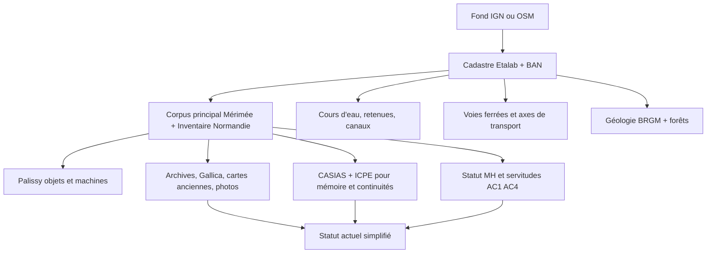

# Données exploitables pour cartographier le patrimoine industriel de l’Orne

## Résumé exécutif

Le noyau dur de ton futur jeu de données existe déjà, mais il est fragmenté. Pour cartographier sérieusement le patrimoine industriel de l’Orne, la combinaison la plus solide est la suivante : **POP/Mérimée** pour les notices d’édifices, **Palissy** pour les objets et machines protégés, **l’Inventaire du patrimoine normand** pour les dossiers de terrain les plus riches, **data.culture.gouv.fr** pour les exports structurés des Monuments historiques, **les Archives départementales de l’Orne** pour les plans, cadastres et inventaires, puis **Géorisques/CASIAS**, **cadastre/BAN**, **IGN**, **OpenStreetMap** et **Gallica** pour l’enrichissement spatial, historique et documentaire. citeturn24view0turn24view2turn21search0turn29search1turn34view1turn6search0turn6search1turn33view0turn28view0turn28view2turn10search1turn10search3turn11search1

Côté corpus patrimonial, la base la plus structurante est l’étude officielle de l’Inventaire sur le patrimoine industriel de l’Orne : elle rappelle que les recherches documentaires ont permis d’identifier **2 500 sites actifs au XIXe siècle ou au début du XXe siècle**, et que les prospections ont abouti à **319 établissements** étudiés, en activité ou désaffectés. Le corpus public de l’Inventaire normand affiche bien **319 dossiers** pour cette opération, ce qui en fait un socle éditorial très cohérent pour un projet de cartographie culturelle. citeturn21search0turn21search1

Côté “mémoire industrielle élargie”, **CASIAS/BASIAS** est extrêmement utile. Le rapport BRGM sur l’inventaire des anciens sites industriels en Basse-Normandie recense pour l’Orne **2 040 sites dans 286 communes**, dont environ **49,5 % géoréférencés** au moment du bilan, avec une forte proportion de sites à activité terminée ou à statut inconnu. Cette source n’est pas patrimoniale au sens culturel, mais elle est excellente pour repérer les **friches**, les sites disparus, les réaffectations et les zones à investiguer manuellement. citeturn37view0turn37view0turn37view0turn37view0turn38view1

Sur **data.gouv.fr**, il existe bien des jeux utiles pour un projet sur l’Orne, mais **pas de jeu clé-en-main dédié au “patrimoine industriel de l’Orne”** qui remplacerait POP/Inventaire. Les résultats vraiment utiles trouvés lors de cette revue sont surtout des couches **complémentaires** : périmètres de protection MH **AC1**, servitudes patrimoniales **AC4/ZPPAUP**, **Cadastre Etalab**, **BAN**, couches de **géologie BRGM**, ainsi que les jeux **CASIAS** et **ICPE**. En pratique, data.gouv sert surtout à enrichir le corpus principal, pas à le constituer seul. citeturn32view0turn32view1turn32view2turn28view0turn28view2turn40search1turn33view0turn33view1

Le principal point d’attention juridique est simple : **les métadonnées patrimoniales sont largement réutilisables**, mais **les images ne le sont pas toutes automatiquement**. POP indique que les informations publiques sont téléchargeables sur data.culture.gouv.fr, tout en rappelant que certains contenus textuels et multimédias peuvent rester soumis au droit d’auteur. Certaines notices affichent d’ailleurs des crédits photographiques avec “utilisation soumise à autorisation”. Pour un projet éditorial ou une appli publique, il faut donc séparer très tôt **métadonnées ouvertes** et **visuels à vérifier**. citeturn24view0turn3search2

Pour un démarrage individuel, le meilleur angle est donc un **MVP cartographique documentaire** : extraction du corpus Orne depuis Mérimée/Inventaire/Palissy, normalisation des communes et coordonnées, ajout d’un statut actuel simplifié, puis enrichissement spatial par cours d’eau, forêts, géologie et mobilité. L’appli interactive viendra ensuite, quand le graphe des relations entre sites, vallées, ressources et reconversions sera déjà propre. citeturn19view0turn19view1turn19view3turn27view2turn40search1

## Ce que chaque source apporte réellement

Le point important n’est pas seulement d’additionner des sources, mais de comprendre **ce qu’elles savent faire**. Certaines sont fiables pour le **statut juridique**, d’autres pour la **description historico-technique**, d’autres encore pour la **géométrie**, la **visitabilité** ou la **mémoire des sites disparus**. Le tableau ci-dessous classe les sources selon cet usage. Les colonnes “qualité” et “facilité d’accès” sont une **évaluation analytique** fondée sur la richesse des champs, la présence de formats téléchargeables, la stabilité d’accès et le niveau de normalisation visible dans les ressources officielles. citeturn24view0turn29search1turn34view1turn6search0turn33view0turn28view0turn27view2turn11search1

| Source | URL | Type de données | Licence | Géolocalisation disponible | Champs clés | Qualité | Facilité d’accès | Notes d’usage |
|---|---|---|---|---|---|---|---|---|
| POP – Mérimée | `pop.culture.gouv.fr` | Notices d’édifices et sites patrimoniaux | Etalab 2.0 sauf mention contraire | Souvent localisation communale, parfois plus fine via notice/cadastre/cours d’eau | dénomination, historique, dates, énergie, état, statut juridique, parties constituantes | Élevée | Élevée | Très fort pour les **forges, moulins, usines, papeteries, tréfileries** et pour documenter les transformations d’usage. citeturn24view2turn19view0turn19view1turn18search4turn18search13 |
| POP – Palissy | `pop.culture.gouv.fr` | Objets et ensembles mobiliers protégés ou étudiés | Etalab 2.0 sauf mention contraire | Plus variable, souvent liée à l’édifice | catégorie technique, matériaux, état, historique, lien Mérimée | Élevée pour les objets protégés | Moyenne | Indispensable pour les **machines, modèles, outillages, collections techniques**. Très utile pour compléter un site comme les Forges de Varenne ou Bohin. citeturn34view1turn19view1 |
| data.culture – Immeubles MH | `data.culture.gouv.fr/explore/dataset/liste-des-immeubles-proteges-au-titre-des-monuments-historiques/` | Export structuré des immeubles protégés issus de Mérimée | Licence ouverte | Oui, **coordonnées WGS84** annoncées ; certains monuments restent en cours de géolocalisation | référence, protection, état, historique, cours d’eau, matériaux, WGS84 | Très élevée | Très élevée | C’est la meilleure porte d’entrée **machine-readable** pour les sites protégés. citeturn34view0 |
| data.culture – Objets MH | `data.culture.gouv.fr/explore/dataset/liste-des-objets-mobiliers-propriete-publique-classes-au-titre-des-monuments/` | Export structuré des objets protégés issus de Palissy | Licence ouverte | Pas aussi simple que les immeubles ; localisation liée au bien/édifice | référence, dénomination, catégorie technique, état, année, matériaux, notice liée | Très élevée | Très élevée | À croiser avec Mérimée pour enrichir les sites en **patrimoine technique**. citeturn34view1 |
| Inventaire du patrimoine normand | `inventaire-patrimoine.normandie.fr` | Dossiers d’inventaire, corpus, illustrations, PDF | Droits Région Normandie / Inventaire selon dossier | Souvent précise au niveau du site, mais pas repérée ici sous forme d’API bulk documentée | dossier, commune, historique détaillé, illustrations, bibliographie, notices liées | Très élevée | Moyenne | C’est la source la plus riche pour raconter les **chaînes techniques** et les contextes locaux. Le corpus Orne compte 319 dossiers. citeturn21search1turn19view3turn18search3 |
| Archives départementales de l’Orne | `archives.orne.fr` | Inventaires, cadastre napoléonien, instruments de recherche, PDF, images | Conditions propres au site / documents | Variable ; souvent document-level, pas SIG nativement | cotes, plans, cadastre, dossiers d’usines, séries M/T/J/FI | Moyenne à élevée | Moyenne à faible | Excellent pour la **preuve historique**, les plans et les séries d’**établissements classés** ; moins bon pour une ingestion automatique rapide. citeturn6search0turn6search1turn6search4turn37view1turn38view2 |
| Géorisques – CASIAS | `georisques.gouv.fr` | Anciens sites industriels et activités de services | Etalab 2.0 | Variable ; une part importante a une localisation, mais le niveau de précision n’est pas homogène | identifiants SSP/BASIAS, raison sociale, activité, état d’occupation, commune | Élevée pour la mémoire des sites | Élevée | Source-clé pour repérer **friches**, cessations d’activité, zones à instruire. Pas patrimoniale, donc à filtrer. citeturn33view0turn37view0turn38view1 |
| Géorisques – ICPE | `georisques.gouv.fr` | Installations classées actuelles ou suivies | Etalab 2.0 | Oui | activité, statut, inspections, mise à jour quotidienne | Bonne | Élevée | Utile pour repérer les **continuités industrielles** et distinguer un ancien site patrimonial d’un site encore industriel. citeturn33view1turn33view2 |
| Cadastre Etalab | `cadastre.data.gouv.fr` | Parcelles et bâtiments cadastraux | Licence ouverte | Oui, géométrie parcellaire | parcelles, bâtiments, identifiants cadastraux | Très élevée | Élevée | Essentiel pour **recoller une notice patrimoniale à une emprise réelle**. Formats GeoJSON et SHP. citeturn28view0turn28view1 |
| BAN | `adresse.data.gouv.fr` / `data.gouv.fr` | Référentiel national d’adresses | Licence ouverte | Oui | adresse, points d’adresse, API, flux | Très élevée | Très élevée | Sert à normaliser les adresses des sites visitables ou reconvertis. citeturn28view2 |
| IGN Géoplateforme | `cartes.gouv.fr` / `data.geopf.fr` | WFS/WMS/WMTS, fonds topo, orthos, couches territoriales | Etalab 2.0 sauf mention contraire | Oui, géométrie SIG | couches topo, hydro, ferroviaire, orthos, WFS | Très élevée | Élevée | Source-clé pour les **cours d’eau, voies ferrées, fonds de carte et orthophotos** ; WFS limité à 5 000 objets par requête. citeturn27view2turn12search9 |
| OpenStreetMap / Overpass | `openstreetmap.org` / `overpass-api.de` | Données contributives, requêtes thématiques | ODbL | Oui | `industrial=*`, `historic=*`, `railway=*`, `waterway=*`, bâtiments, toponymes | Moyenne à bonne | Très élevée | Très utile pour le **repérage opportuniste** et les traces fines, mais l’homogénéité dépend des contributeurs. citeturn10search3turn26search4turn26search3turn26search20 |
| Gallica / BnF | `gallica.bnf.fr` / `api.bnf.fr` | Presse, cartes, photos, livres, métadonnées, APIs SRU/IIIF | Métadonnées en licence ouverte ; contenus selon conditions | Généralement non SIG natif | notices, ARK, presse, cartes anciennes, images | Élevée pour l’historique | Élevée | Parfait pour retrouver **cartes anciennes, presse locale, iconographie**, mais il faut géocoder ensuite. citeturn11search1turn11search8turn25search2turn25search5 |

### Suggestion d’overlay cartographique

Ce projet gagne à être pensé comme une **pile de couches**, et non comme une simple carte de points. Les notices patrimoniales apportent le sens, les données de géométrie apportent l’emprise, et les couches historiques apportent la narration. Les exemples de Bohin, des Forges de Varenne ou de Longny montrent bien que l’intelligibilité vient du croisement entre **site**, **cours d’eau**, **cadastre**, **ressource** et **état actuel**. citeturn19view0turn19view1turn19view3



## Présence sur data.gouv.fr et mots-clés testés

La réponse courte est **oui, des jeux existent**, mais ils sont surtout **satellites** du sujet, pas son cœur documentaire. Lors de cette revue, les mots-clés les plus naturels pour un projet patrimonial local — *patrimoine industriel Orne*, *Mérimée Orne*, *Palissy Orne*, *manufacture Bohin*, *forge Orne*, *papeterie Orne*, *tuilerie Orne* — n’ont pas fait émerger un dataset unique “prêt à l’emploi” pour le patrimoine industriel ornais. En revanche, on trouve sur data.gouv et les portails publics associés plusieurs briques très exploitables : **AC1**, **AC4/ZPPAUP**, **cadastre**, **BAN**, **géologie BRGM**, **CASIAS**, **ICPE** et parfois des couches ponctuelles de contexte territorial. citeturn32view0turn32view1turn32view2turn28view0turn28view2turn40search1turn33view0turn33view1

| Mot-clé testé | Lecture du résultat | Intérêt réel pour le projet |
|---|---|---|
| `patrimoine industriel Orne` | Pas de jeu dédié repéré sur data.gouv lors de cette revue | Passer par POP/Inventaire comme corpus principal |
| `Mérimée Orne` | Le chemin utile bascule surtout vers POP et data.culture | Très bon pour les sites protégés et les notices d’édifices |
| `Palissy Orne` | Même logique : meilleur point d’entrée via data.culture / POP | Très bon pour machines, objets techniques, collections |
| `manufacture Bohin` | Pas de dataset dédié repéré | Cas d’étude à documenter depuis Mérimée, tourisme, inventaire |
| `forge / moulin / papeterie / tuilerie Orne` | Résultats dispersés | Bon pour l’exploration, insuffisant comme source principale |

Les jeux data.gouv les plus immédiatement utiles sont les suivants. **AC1** t’aide à afficher les périmètres de protection autour des monuments historiques dans l’Orne ; **AC4/ZPPAUP** et ses dérivés visualisent l’environnement réglementaire patrimonial ; **Cadastre Etalab** fournit la géométrie parcellaire ; **BAN** normalise les adresses ; **BRGM Charm-50** apporte la géologie ; **CASIAS** remonte la mémoire des sites industriels ; **ICPE** aide à repérer les continuités ou survivances industrielles. citeturn32view0turn32view1turn32view2turn28view0turn28view2turn40search1turn33view0turn33view1

Pour la **visitabilité**, les offices de tourisme sont utiles, mais comme **surcouche éditoriale**, pas comme corpus scientifique. Orne Tourisme met bien en avant la **Manufacture Bohin**, le **Parc des Forges de Varenne**, la **Maison du Fer**, la **Minière de La Ferrière-aux-Étangs** et d’autres lieux de découverte ; cela suffit pour enrichir un champ “visitable / médiatisé”, mais pas pour couvrir l’ensemble du patrimoine invisible, privé, ruiné ou disparu. citeturn8search0turn8search1turn8search9turn8search24

Enfin, le **Parc naturel régional du Perche** constitue une source locale intéressante pour des sous-secteurs de l’Orne, car il mène un inventaire bâti sur son territoire et publie des travaux communaux détaillés. Ce n’est pas un répertoire industriel départemental complet, mais c’est une excellente base locale pour le **Perche ornais**, notamment autour de Longny et des moulins. citeturn20view0turn18search6turn9search2

## Qualité, complétude et biais des données

La différence la plus importante, méthodologiquement, est celle qui sépare **la donnée patrimoniale normative** de **la donnée de mémoire industrielle**. Mérimée, Palissy et les exports data.culture sont très solides pour les **sites protégés**, les descriptions d’édifices, les champs de statut juridique et un certain nombre de caractéristiques techniques. En revanche, ils ne couvrent pas tout ce qui a existé, ni tout ce qui a disparu. C’est précisément pour cela que CASIAS/BASIAS est précieux : il élargit le regard à des milliers d’anciens sites, mais avec une normalisation patrimoniale plus faible. citeturn34view0turn34view1turn33view0turn37view0turn38view1

La **géolocalisation** est bonne mais hétérogène. Le dataset des immeubles protégés diffuse des **coordonnées WGS84** et précise que certains monuments sans coordonnées sont encore “en cours de géolocalisation”. Le rapport BRGM sur l’Orne montre de son côté que seulement **1 010 sites sur 2 040** avaient été géoréférencés lors du bilan BASIAS, soit **49,5 %**. Cela signifie que, pour un projet cartographique propre, il faut prévoir une **phase de re-géocodage** substantielle à partir du cadastre, de la BAN, d’IGN, des notices d’archives et, parfois, de l’iconographie ancienne. citeturn34view0turn38view1turn28view0turn28view2

Les **dates** sont souvent disponibles mais pas toujours de la même manière. Les dates de construction et les siècles de campagne sont largement structurés dans Mérimée ; en revanche, les dates de fermeture, de transfert d’activité ou de reconversion restent souvent dans le **texte libre de l’historique**. Les notices de Bohin, des Forges de Varenne, de la “Batterie” ou d’autres tréfileries montrent exactement ce comportement : années de construction normalisées, mais cessation, reconversion en logements, entrepôt ou désaffectation décrites dans la narration historique. citeturn19view0turn19view1turn18search4turn18search13

L’**état de conservation** et le **statut actuel** existent, mais ils ne sont pas encore assez homogènes pour une carte “plug and play”. On trouve des valeurs parlantes dans les notices — par exemple “établissement industriel désaffecté”, “bâtiments convertis en logements”, “usage d’entrepôt”, “machines toujours en fonctionnement” —, mais le passage à une taxonomie simple du type **abandonné / reconverti / musée / en activité / privé** demandera un travail éditorial de normalisation. citeturn19view1turn19view0turn18search4turn18search13

Les **archives départementales** sont d’une grande valeur, mais elles introduisent un biais d’accès : elles excellent pour la **preuve**, les **plans** et les **inventaires de dossiers**, moins pour l’export direct en masse. Leur intérêt, ici, est surtout de confirmer des cas, de retrouver les emprises ou les séries documentaires sur les **moulins et usines**, les **établissements classés**, le **cadastre napoléonien**, ou des plans d’installations. Il faut donc les considérer comme une couche de **vérification et d’enrichissement**, pas comme la source initiale du scraping massif. citeturn6search0turn6search1turn6search4turn37view1turn38view2

Les **images** demandent enfin une vigilance particulière. POP précise que les informations publiques regroupées dans la plateforme sont téléchargeables via data.culture, mais rappelle aussi que certaines informations textuelles et multimédias peuvent être soumises au droit d’auteur. Une notice POP de Joconde montre explicitement des crédits photographiques “utilisation soumise à autorisation”. Pour ton projet, la bonne doctrine est donc : **métadonnées ouvertes par défaut ; image vérifiée avant publication**. citeturn24view0turn3search2

## Plan d’extraction automatisée minimal

Le plan minimal recommandé est de partir d’un **corpus patrimonial propre**, puis de l’élargir. En pratique :

1. extraire les **sites de l’Orne** depuis les exports Mérimée/Palissy et le corpus Inventaire ;
2. normaliser les **communes**, **références**, **liens POP** et **coordonnées** ;
3. enrichir avec **CASIAS** pour capter l’ombre industrielle non patrimonialisée ;
4. ajouter les couches spatiales de **cours d’eau**, **forêts**, **géologie**, **voies ferrées** et **parcelles** ;
5. compléter manuellement le champ **visitable / reconversion / musée / privé / friche** depuis les sites touristiques et les notices ;  
6. seulement ensuite développer la carte interactive. citeturn21search0turn21search1turn33view0turn27view2turn28view0turn8search0turn8search1

### Timeline schématique de collecte

```mermaid
flowchart LR
    A[Extraction data.culture Mérimée/Palissy] --> B[Ajout corpus Inventaire Normandie]
    B --> C[Nettoyage communes références coordonnées]
    C --> D[Croisement Cadastre BAN IGN]
    D --> E[Enrichissement CASIAS ICPE]
    E --> F[Ajout couches eau forêts géologie rail]
    F --> G[Vérification Archives Gallica photos]
    G --> H[Normalisation statut actuel visitabilité]
    H --> I[QGIS puis appli interactive]
```



### Endpoints et requêtes utiles

Voici des exemples concrets, conçus pour un extraction **niveau MVP**. Ils reposent sur des services publics documentés ou sur des endpoints explicitement exposés.

```bash
# Immeubles protégés MH (Mérimée) - export CSV filtrable
https://data.culture.gouv.fr/api/records/1.0/download/?dataset=liste-des-immeubles-proteges-au-titre-des-monuments-historiques&format=csv&refine.departement_en_lettres=Orne

# Immeubles protégés MH - recherche JSON
https://data.culture.gouv.fr/api/records/1.0/search/?dataset=liste-des-immeubles-proteges-au-titre-des-monuments-historiques&rows=100&q=Orne
```

Ces exemples s’appuient sur le dataset officiel des immeubles protégés, son identifiant public et la documentation Opendatasoft sur les paramètres `search`, `download`, `rows` et `refine`. Le dataset expose notamment les champs de protection, d’état, de cours d’eau, de matériaux et les coordonnées WGS84. citeturn34view0turn14search1turn14search2

```bash
# Objets protégés MH (Palissy) - recherche JSON
https://data.culture.gouv.fr/api/records/1.0/search/?dataset=liste-des-objets-mobiliers-propriete-publique-classes-au-titre-des-monuments&rows=100&q=Orne
```

Le dataset Palissy officiel annonce des champs adaptés aux objets techniques : catégorie technique, état, année de création, matériaux, historique, notice Mérimée liée, etc. C’est la bonne source pour récupérer les objets patrimoniaux associés à un site industriel. citeturn34view1

```bash
# IGN Géoplateforme
https://data.geopf.fr/wfs?
https://data.geopf.fr/wms-r/wms?
https://data.geopf.fr/wms-v/wms?
https://data.geopf.fr/wmts?SERVICE=WMTS&VERSION=1.0.0&REQUEST=GetCapabilities
```

Ces URL sont documentées par l’IGN pour l’usage dans QGIS. L’aide officielle précise aussi que l’affichage WFS est limité à **5 000 objets par requête**, ce qui t’oblige à découper par emprise ou par couche si tu automatises. citeturn27view2

```ql
[out:json][timeout:120];
area["name"="Orne"]["boundary"="administrative"]["admin_level"="6"]->.searchArea;
(
  nwr(area.searchArea)["industrial"];
  nwr(area.searchArea)["historic"="mill"];
  nwr(area.searchArea)["man_made"="watermill"];
  nwr(area.searchArea)["railway"];
  nwr(area.searchArea)["waterway"];
);
out center tags;
```

Cette requête Overpass illustre le bon usage d’OSM comme source d’appoint pour repérer des moulins, traces industrielles, voies ferrées ou objets hydrographiques. Overpass est bien documentée et délivre des sorties exploitables en JSON/XML ; la donnée OSM reste soumise à l’ODbL. citeturn10search3turn10search15turn26search4turn26search20

```bash
# Gallica SRU - exemple de recherche
https://gallica.bnf.fr/SRU?operation=searchRetrieve&version=1.2&query=dc.title all "Orne" and dc.title all "forge"&maximumRecords=20

# Gallica document API
https://gallica.bnf.fr/services/OAIRecord?ark=ark:/12148/...
```

La BnF documente l’API de recherche Gallica en **SRU 1.2** et l’API Document pour récupérer les métadonnées d’une ressource. Pour ton sujet, c’est utile surtout pour la **presse**, les **cartes anciennes**, les **photos** et les monographies locales. citeturn11search1turn11search8

### Snippets d’export utiles

Exemple de **headers CSV** à viser pour ton entrepôt principal après normalisation :

```csv
id_source,source,reference_pop,base,commune,code_insee,departement,denomination,
titre_courant,statut_juridique,protection_mh,date_protection,etat_conservation,
annee_construction,annee_fermeture,date_notice,coord_x,coord_y,wgs84_lon,wgs84_lat,
cours_eau,energie,activite_historique,usage_actuel,visitable,reconversion,friche,
cadastre,url_notice,source_image,licence
```

Ce schéma combine les champs publiquement visibles dans le dataset Mérimée protégé, les champs Palissy, les états d’occupation CASIAS et les éléments pratiques de la chaîne de publication. Les exports officiels montrent que les informations “cours d’eau”, “état”, “protection”, “statut juridique”, “WGS84” ou “activité/occupation” existent déjà, mais dans des structures distinctes qu’il faudra fusionner. citeturn34view0turn34view1turn33view0

### Outils recommandés

Le stack minimal recommandé est :

- **Python** pour l’extraction et le nettoyage ;
- `requests` pour les appels HTTP ;
- `pandas` pour les tables ;
- `geopandas` pour les jointures spatiales ;
- `qgis` pour le contrôle qualité cartographique ;
- éventuellement `beautifulsoup4` pour l’Inventaire normand si tu automatises la collecte HTML ;
- éventuellement `rapidfuzz` pour les rapprochements de toponymes et de raisons sociales.

Ce choix est cohérent avec les formats réellement disponibles : **CSV/JSON** côté data.culture, **CSV/SHP** côté Géorisques, **GeoJSON/SHP** côté cadastre Etalab, **WFS/WMS/WMTS** côté IGN, **XML/SRU/IIIF** côté BnF, et **JSON/XML** côté OSM/Overpass. citeturn34view0turn34view1turn33view0turn33view1turn28view1turn27view2turn11search1turn10search15

## Recommandations prioritaires et estimation de charge

### Recommandations de croisement à faire en priorité

La meilleure valeur ajoutée éditoriale viendra des croisements suivants :

| Croisement | Pourquoi c’est prioritaire |
|---|---|
| Sites patrimoniaux × cours d’eau | Dans l’Orne, une grande partie des moulins, papeteries, forges, tréfileries et ateliers s’expliquent par l’énergie hydraulique et les vallées. Bohin est au bord de la Risle ; Longny illustre magistralement le lien entre moulins, métallurgie et réseau hydrographique. citeturn19view0turn19view3 |
| Sites × forêts | La métallurgie ancienne dépend fortement du charbon de bois et donc des massifs forestiers ; le corpus de Longny relie explicitement industrie du métal et forêts de Longny, Réno et Valdieu. citeturn19view3 |
| Sites × géologie / gisements | Les couches géologiques BRGM aident à comprendre la localisation des forges, tuileries et activités extractives ; elles sont particulièrement utiles pour produire une carte analytique, pas seulement descriptive. citeturn40search1 |
| Sites × voies ferrées | Les voies ferrées expliquent certains redéploiements du XIXe-XXe siècle et la logistique des établissements ; OSM et IGN permettent d’ajouter cette couche facilement. citeturn26search3turn27view2 |
| Sites × cadastre actuel / napoléonien | C’est le meilleur moyen de montrer la continuité ou la disparition des emprises industrielles, et d’ancrer les notices historiques dans le territoire réel. citeturn6search1turn6search4turn28view1 |
| Sites × cartes anciennes / Gallica / archives | C’est ce qui transforme une carte de points en **récit documenté**. Cela permet aussi de retrouver des sites mal géolocalisés ou détruits. citeturn11search1turn25search5turn6search0 |

### Ce qu’il faut faire maintenant

Voici l’ordre de travail que je recommande pour un projet individuel, ambitieux mais réaliste.

- [ ] Extraire d’abord le **socle Orne** depuis **Mérimée/Immeubles MH**, **Palissy/Objets MH** et le **corpus Inventaire Normandie**. citeturn34view0turn34view1turn21search1
- [ ] Construire une table unique `sites_industriels_orne` avec un identifiant interne stable et les liens vers les notices POP. citeturn19view0turn19view1
- [ ] Ajouter un champ éditorial `statut_actuel` avec une taxonomie simple : `en_activite`, `musee_visitable`, `reconverti`, `desaffecte`, `friche`, `inconnu`. Les notices POP et CASIAS te donnent déjà une bonne partie de la matière. citeturn19view1turn18search4turn18search13turn33view0
- [ ] Géocoder ou corriger les cas faibles via **BAN**, **cadastre**, **IGN** et, si besoin, **archives**. citeturn28view2turn28view0turn27view2turn6search1
- [ ] Ajouter les couches analytiques : **cours d’eau**, **forêts**, **géologie**, **voies ferrées**. citeturn27view2turn40search1
- [ ] Enrichir manuellement le champ `visitable` depuis **Orne Tourisme** et les opérateurs culturels locaux. citeturn8search0turn8search1turn8search9turn8search24
- [ ] Réserver **Gallica** et les **archives** pour les cas emblématiques, les timelines et les visuels historiques. citeturn11search1turn25search5turn6search0

### Estimation de temps par niveau de projet

Ces durées sont des **estimations de production** pour une personne seule, avec un niveau développeur Python intermédiaire, sans contrainte budgétaire majeure.

| Niveau | Objectif | Charge probable | Sortie |
|---|---|---:|---|
| Niveau minimal | Corpus propre + première carte QGIS / web simple | 4 à 7 jours | CSV/GeoJSON propre, 150 à 350 sites réellement qualifiés, première carte statique ou Folium |
| Niveau intermédiaire | Enrichissement spatial + statuts actuels + quelques cas d’étude illustrés | 2 à 4 semaines | carte analytique crédible, filtres sectoriels, pages de site, premières narrations |
| Niveau ambitieux | Application interactive + design + iconographie + recherche approfondie | 6 à 12 semaines | appli éditoriale publique, UX travaillée, moteur de filtres, storytelling, galerie documentaire |

### Mon avis de priorité stratégique

Si tu veux maximiser le ratio **temps investi / résultat visible**, je te conseille de viser d’abord un **niveau minimal très propre** :  
un corpus patrimonial + une carte + des filtres de base + 10 à 20 sites emblématiques très bien enrichis. Les exemples évidents sont **Bohin**, **Forges de Varenne**, quelques **moulins à papier du Perche**, quelques **tréfileries** de la vallée de la Risle, et un ou deux cas de **reconversion** ou de **désaffectation** très lisibles. Les notices disponibles sur Bohin, Varenne, Longny, Rai, Tinchebray ou Saint-Hilaire-sur-Risle montrent que ce niveau de profondeur est déjà atteignable sans attendre une grosse appli. citeturn19view0turn19view1turn19view3turn18search8turn18search9turn20view1

Le vrai potentiel éditorial du sujet, enfin, ne tient pas seulement au fait que l’Orne possède des forges, des moulins ou des papeteries. Il tient au fait que les sources publiques permettent de montrer, de manière très visuelle, **comment un département aujourd’hui perçu comme rural et discret superpose en réalité vallées hydrauliques, forêts, métallurgie, textile, papier, quincaillerie, mines, reconversions et sites oubliés**. Les données officielles sont déjà suffisamment riches pour le prouver. citeturn21search0turn19view3turn19view0turn19view1turn33view0