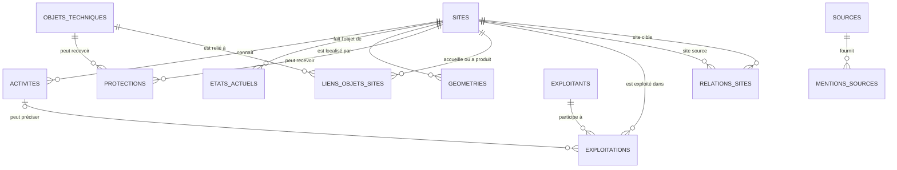

# Modèle de données — entités principales

Statut : **validé pour le bloc 1 de la phase 3 — version conceptuelle 0.2**
Date : 20 juillet 2026

## Principe central

Le modèle distingue le lieu, ce qui s'y est passé, ce qu'il en reste et les
preuves utilisées :

- `sites` représente une emprise géographique distincte ;
- `activites` représente une phase industrielle documentée sur ce site ;
- `etats_actuels` représente une observation contemporaine datée ;
- `sources` décrit les fonds et jeux de données ;
- `mentions_sources` relie une information précise à sa preuve ;
- les autres tables décrivent protections, objets, géométries, exploitants et
  relations entre lieux.

Une notice source n'est jamais transformée automatiquement en site. Plusieurs
notices peuvent documenter un même site et une notice peut nécessiter plusieurs
entités structurées.

## Vue d'ensemble

`mentions_sources` peut cibler une ligne ou un champ de n'importe quelle table
métier. Ce lien est volontairement générique afin de conserver la provenance
au niveau de l'information, et pas seulement au niveau du site.

## Entités validées

### `sites`

Un site correspond à une emprise distincte. Il conserve le même identifiant à
travers les changements d'activité, de nom, d'exploitant et d'usage. Deux
emprises distinctes restent deux sites, même si elles appartiennent à la même
entreprise.

La table porte l'identité éditoriale et le statut du corpus. Elle ne porte ni la
chronologie des activités, ni l'état actuel, ni les coordonnées de référence.
Ces informations évolutives sont placées dans les tables dédiées.

Une table auxiliaire `noms_sites` conservera les appellations alternatives et
leurs périodes lorsqu'elles sont connues. Une liste de noms dans une cellule est
donc écartée.

### `activites`

Une ligne représente une phase d'activité documentée sur un site : forge,
filature, moulin à farine, briqueterie, production électrique, etc. Un site peut
posséder plusieurs activités simultanées ou successives.

Le secteur, l'activité détaillée, le type d'installation et les énergies sont
séparés. Les énergies multiples seront portées par la table auxiliaire
`energies_activites` plutôt que par une liste non contrôlée.

Les règles précises pour les dates incertaines et les activités successives
seront arrêtées dans le bloc suivant de la phase 3.

### `etats_actuels`

Une ligne représente une observation contemporaine datée. Les anciennes
observations ne sont jamais écrasées : une nouvelle vérification ajoute une
ligne.

Conservation, usage et accessibilité restent trois dimensions distinctes. Une
observation peut ne renseigner qu'une partie de ces dimensions lorsque la source
ne permet pas de conclure sur les autres. Chaque valeur peut être reliée à sa
propre mention de source.

### `sources`

Cette table est le catalogue stable des sources : producteur, titre, rôle,
licence, URL de référence et méthode d'accès. Elle ne contient pas une ligne par
notice téléchargée.

Les références individuelles `IA`, `PM`, `PA`, `SSP`, cotes d'archives et URL
précises sont conservées dans `mentions_sources`.

### `mentions_sources`

Une mention est une unité de preuve. Elle conserve la source, la référence de
la notice, la date de consultation, la valeur originale et la nature de
l'information : `sourcee`, `calculee` ou `interpretee`.

La cible est décrite par :

- le type d'entité ;
- l'identifiant de la ligne ciblée ;
- éventuellement le nom du champ précis.

Ce ciblage générique ne pourra pas reposer sur une clé étrangère SQL unique. Un
validateur contrôlera que l'entité et le champ existent. Cette contrainte devra
être testée lors de l'implémentation DuckDB.

### `protections`

Une ligne représente une mesure de protection juridique ou patrimoniale datée.
La cible est soit un site, soit un objet technique, jamais les deux dans la même
ligne. La référence `PA` ou `PM` est conservée comme référence externe, mais ne
devient pas l'identifiant interne de la protection.

L'élément réellement protégé est décrit séparément afin de ne pas faire croire
qu'une protection partielle concerne toute l'emprise industrielle.

### `objets_techniques`

Cette table représente les machines, collections, outils et éléments mobiliers
documentés. Un objet ne possède pas directement un `site_id` unique, car il peut
avoir un site d'origine et un emplacement actuel différents.

La table `liens_objets_sites` qualifie la relation : origine, fabrication,
utilisation, emplacement historique, emplacement actuel ou association
documentaire.

### `geometries`

Un site peut posséder plusieurs géométries : point approximatif, bâtiment
vérifié, parcelle, emprise ou zone documentaire. Chaque géométrie conserve sa
méthode, sa précision, sa source, sa date et son statut de validation.

Décisions retenues :

- stockage de travail en Lambert-93, `EPSG:2154` ;
- export web en WGS84, `EPSG:4326` ;
- aucune longitude ou latitude directement dans `sites` ;
- une géométrie de référence au maximum par site et par usage ;
- conservation possible d'un site sans géométrie si sa commune est attestée ;
- interdiction de transformer un centroïde communal en emplacement de site ;
- rejet de la géométrie CASIAS lorsqu'aucune coordonnée WGS84 explicite n'est
  fournie pour le site.

Le type SQL précis dépendra de l'extension spatiale DuckDB et sera confirmé lors
de l'implémentation.

### `exploitants` et `exploitations`

La table `exploitants` est nécessaire.

Motifs :

- un site peut changer plusieurs fois d'exploitant ;
- un exploitant peut gérer plusieurs sites ;
- une raison sociale peut changer sans déplacement du site ;
- le propriétaire, l'exploitant et le commanditaire ne sont pas toujours la
  même personne ou organisation et ne doivent pas être confondus.

`exploitants` décrit la personne ou l'organisation. La table d'association
`exploitations` relie un exploitant à un site, éventuellement à une phase
d'activité, avec un rôle d'exploitation et une période. Un propriétaire ou un
fondateur n'y entre que s'il a aussi exploité le site. Les variantes de nom
seront conservées dans `noms_exploitants`.

### `relations_sites`

Cette table représente une relation documentée entre deux emprises distinctes.
Elle ne sert pas à fusionner les sites.

Types initiaux :

- `composant_de` : le site source est un composant du site cible ;
- `transfert_vers` : l'activité du site source est déplacée vers le site cible ;
- `successeur_de` : le site source succède fonctionnellement au site cible ;
- `depend_de` : le site source dépend fonctionnellement du site cible ;
- `partage_infrastructure_avec` : relation symétrique documentée.

Chaque relation possède une direction, sauf les types explicitement
symétriques. Une relation ne peut pas relier un site à lui-même. Une proposition
incertaine reste au statut `a_verifier` et ne déclenche aucune fusion.

## Tables auxiliaires nécessaires

| Table | Fonction |
|---|---|
| `noms_sites` | appellations alternatives et historiques d'un site |
| `energies_activites` | énergies associées à une phase d'activité |
| `liens_objets_sites` | origine, usage et localisation des objets techniques |
| `exploitations` | relation datée entre site, exploitant et éventuellement activité |
| `noms_exploitants` | raisons sociales et variantes historiques |

Ces tables sont incluses dans le modèle conceptuel, mais leurs contraintes
détaillées seront précisées dans les blocs « Définir les règles » et
« Implémenter le modèle ».

## Cas de validation

Le modèle représente les situations suivantes sans dupliquer artificiellement
les sites :

1. une forge devenue moulin : un site, plusieurs activités successives ;
2. une usine déplacée : deux sites reliés par `transfert_vers` ;
3. un complexe avec barrage et atelier autonomes : plusieurs sites reliés par
   `composant_de` lorsque chacun possède une identité documentaire ;
4. une machine déplacée dans un musée : un objet et plusieurs liens objet-site ;
5. plusieurs entreprises sur la même emprise : un site et plusieurs
   exploitations datées ;
6. un site disparu connu seulement à l'échelle communale : un site conservé
   sans géométrie artificielle ;
7. un état contemporain révisé : plusieurs observations datées, sans écrasement.

## Ce qui reste ouvert

Ce bloc ne fixe pas encore :

- le format des identifiants internes ;
- les champs obligatoires au-delà des clés structurelles ;
- la représentation SQL des valeurs nulles et inconnues ;
- le modèle détaillé des dates imprécises ;
- les contraintes DuckDB et les index ;
- la version définitive des vocabulaires contrôlés.

Ces décisions correspondent aux blocs suivants de la phase 3 et à la phase 4.
