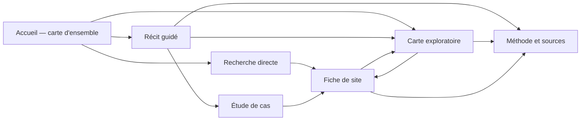

# Phase 10 — Cadrage éditorial et expérience utilisateur

Version : **0.7 — clarification de la rubrique Les lieux et du statut**
Statut : **format éditorial de référence pour les blocs suivants**
Date : 27 juillet 2026

## Rectification de l'angle central

La publication ne doit pas se présenter comme un atlas intitulé « L'Orne
industrielle ». Ce titre de travail déplace le sujet vers un inventaire
territorial et efface la tension à l'origine du projet.

Le point de départ est l'image contemporaine dominante de l'Orne : paysages
ruraux, vallées, prairies, forêts, élevage et petites villes. L'enquête révèle
qu'une histoire industrielle nombreuse et répartie se superpose à cette image
et qu'elle est aujourd'hui peu visible dans la représentation courante du
département.

Le récit ne doit toutefois pas affirmer que l'Orne n'était pas rurale ou
qu'elle possédait une concentration industrielle supérieure à d'autres
départements sans donnée comparative. La formulation journalistiquement
soutenue par le corpus est la suivante :

> L'image uniquement rurale de l'Orne est incomplète. Les 318 sites étudiés
> font apparaître une histoire industrielle largement répartie, liée aux
> paysages, aux ressources, aux bourgs et à des réseaux plus vastes.

Le nom définitif du projet reste à choisir. Le titre de maquette « L'autre
Orne » est rejeté. La recherche de titre doit repartir de l'expression initiale
du sujet : **le patrimoine industriel oublié de l'Orne**.

## Format éditorial retenu pour le bloc 1

Le produit envisagé n'est pas une suite de longs articles illustrés par une
carte. Il associe deux expériences complémentaires :

1. une **expérience de data storytelling**, dans laquelle le défilement fait
   évoluer cartes, graphiques et études de cas selon une progression
   éditoriale ;
2. une **expérience d'exploration libre**, dans laquelle le lecteur recherche,
   filtre, compare et ouvre les fiches des sites dans l'ordre qu'il souhaite.

Ces deux expériences utilisent les mêmes données et restent accessibles l'une
depuis l'autre. Le récit ne bloque jamais le lecteur dans un ordre imposé et la
carte exploratoire ne remplace pas l'explication éditoriale.

Le produit est conçu directement dans sa forme complète, avec photographies,
documents visuels, cartes et datavisualisations. Le cadrage ne prévoit pas une
première version appauvrie sans images. Il part de l'hypothèse de travail que
les autorisations nécessaires seront obtenues ; les crédits et preuves restent
conservés dans les données éditoriales conformément aux décisions de phase 9.

Le récit constitue l'entrée éditoriale recommandée, mais l'exploration et la
recherche restent visibles dès le premier écran. Un lecteur peut donc suivre la
progression proposée, commencer par un lieu précis ou consulter directement la
carte.

## Ce que signifient les termes employés

| Terme | Ce que cela désigne ici | Ce que cela ne désigne pas |
| --- | --- | --- |
| Récit guidé | Une progression éditoriale dans laquelle textes courts, cartes et graphiques changent ensemble au fil du défilement | Un parcours obligatoire ou une navigation empêchant d'aller directement à la carte |
| Exploration libre | Une carte, une recherche, des filtres et des fiches consultables dans n'importe quel ordre | Une accumulation de contrôles sans explication |
| Tableau de bord | Une interface de suivi montrant simultanément beaucoup d'indicateurs et de contrôles | Ce n'est pas la forme principale proposée |
| Itinéraire | Un trajet physique entre plusieurs lieux, avec des informations de visite | Ce n'est pas prévu, car l'accessibilité et la situation actuelle sont insuffisamment documentées |

L'exclusion du tableau de bord ne signifie donc pas l'exclusion de la
datavisualisation. Au contraire, cartes et graphiques doivent porter une grande
part du récit. L'exclusion de l'itinéraire concerne uniquement la promesse
touristique ou le déplacement physique entre des sites.

## Ce que voit le lecteur en arrivant

### Les dix premières secondes

Le lecteur arrive devant une visualisation de l'Orne occupant la majeure partie
de l'écran. Le titre et une phrase courte donnent le sujet. Les sites
apparaissent progressivement sur la carte pour matérialiser immédiatement la
présence industrielle derrière l'image rurale du département.

Trois nombres contextualisés peuvent être visibles sans devenir des indicateurs
de performance :

- 318 sites canoniques documentés dans le corpus de l'Inventaire ;
- 403 phases d'activité structurées ;
- plusieurs siècles d'activités et de transformations.

Le libellé doit préciser qu'il s'agit du corpus étudié, et non du nombre total
de sites industriels ayant existé dans l'Orne.

### Après dix à trente secondes

Le lecteur comprend qu'il peut choisir son mode d'entrée :

- **Commencer le récit** : suivre la progression éditoriale ;
- **Explorer librement les 318 sites** : ouvrir directement la carte ;
- **Chercher un lieu ou une commune** : commencer par une recherche.

Il peut également faire défiler la page sans choisir : la première séquence du
récit commence alors naturellement.

### Après trente secondes

La carte n'est plus seulement une illustration. Le lecteur peut sélectionner un
site, survoler ou parcourir au clavier les points, voir un résumé très court et
ouvrir une fiche. S'il continue à défiler, la visualisation change d'état pour
introduire le premier chapitre.

## Wireframe de la page d'accueil

Le wireframe matérialise uniquement la structure et les interactions. Il ne
préjuge ni des couleurs, ni des typographies, ni de la direction artistique.

```text
┌────────────────────────────────────────────────────────────────────────────┐
│ NOM DU PROJET     Récit   Explorer   Rechercher   Méthode                 │
├────────────────────────────────────────────────────────────────────────────┤
│                                                                            │
│  L'AUTRE ORNE                        ┌───────────────────────────────────┐ │
│  Sur les traces d'un patrimoine      │   PAYSAGE ACTUEL, PUIS CARTE      │ │
│  industriel oublié                   │   ET DONNÉES EN RÉVÉLATION        │ │
│                                      │                                   │ │
│  318 sites documentés                │      •  •     •                    │ │
│  403 phases d'activité               │   •      •  •     •               │ │
│                                      │        •       •                   │ │
│  [Commencer le récit]                │  Les sites apparaissent           │ │
│  [Explorer la carte]                 │  progressivement                   │ │
│  [Rechercher un lieu]                │                                   │ │
│                                      └───────────────────────────────────┘ │
├────────────────────────────────────────────────────────────────────────────┤
│  ↓ Faire défiler : la carte change d'état et le premier chapitre commence │
└────────────────────────────────────────────────────────────────────────────┘
```

Sur un écran étroit, le titre vient avant la carte, puis les trois portes
d'entrée. La carte ne doit pas repousser hors écran l'explication du projet.

### Exemple concret de première séquence

Si le lecteur commence à faire défiler la page, l'ouverture pourrait se
décomposer ainsi :

| Étape | Texte visible | État de la visualisation | Action possible |
| --- | --- | --- | --- |
| 0 | Une image actuelle de l'Orne et la question « Ce paysage raconte-t-il toute l'histoire du territoire ? » | Paysage rural sans symbole industriel ni carte visible | Commencer, explorer ou rechercher |
| 1 | « L'image rurale est réelle, mais elle est incomplète » | Le contour réel du département et les premiers sites émergent du paysage | Sélectionner un point |
| 2 | « L'Inventaire documente ici 318 sites et 403 phases d'activité » | Apparition progressive de l'ensemble des localisations | Choisir une famille de production |
| 3 | « Forges, moulins, filatures, mines, laiteries… » | Les sites se différencient par grandes familles d'activités | Choisir une famille |
| 4 | « Certains lieux ont changé plusieurs fois de production » | Mise en évidence des sites comportant plusieurs phases | Ouvrir une trajectoire |
| 5 | « La carte montre aussi ce que nous savons moins bien » | Les symboles distinguent précision et données à documenter | Afficher l'explication méthodologique |

Cette séquence fait déjà du data storytelling avant tout développement de
chapitre. Elle doit rester courte : elle sert à faire comprendre le projet, pas
à résumer toute l'enquête sur la page d'accueil.

## Les chemins de lecture



Le récit guidé est donc un chemin possible, pas un itinéraire obligatoire. À
tout moment, le lecteur peut quitter la progression, explorer les données ou
ouvrir une fiche. Il peut ensuite revenir au chapitre qu'il lisait.

## Matérialisation du récit guidé

Sur ordinateur, une séquence narrative peut utiliser un dispositif à deux
colonnes : le texte défile à gauche et la visualisation reste visible à droite.
Chaque étape courte modifie l'état du visuel.

```text
┌────────────────────────────────────────────────────────────────────────────┐
│ Chapitre 2/6                         [Explorer librement]  [Méthode]        │
├───────────────────────────────┬────────────────────────────────────────────┤
│                               │                                            │
│  UNE GÉOGRAPHIE INDUSTRIELLE  │                                            │
│                               │        CARTE / GRAPHIQUE PERSISTANT        │
│  Étape 1                      │                                            │
│  Les 318 sites apparaissent.  │        État A : tous les sites             │
│                               │                                            │
│  Étape 2                      │        État B : secteurs mis en évidence   │
│  Les activités se diversifient│                                            │
│  selon les lieux.             │        État C : étude de cas sélectionnée  │
│                               │                                            │
│  Étape 3                      │        [Sélectionner un site]               │
│  Un site peut connaître       │                                            │
│  plusieurs productions.       │                                            │
│                               │                                            │
├───────────────────────────────┴────────────────────────────────────────────┤
│ Chapitre précédent                               Chapitre suivant          │
└────────────────────────────────────────────────────────────────────────────┘
```

Sur mobile, texte et visualisation alternent verticalement. Aucun élément
important ne dépend d'un effet de survol ou d'une animation.

## Matérialisation de l'exploration libre

```text
┌────────────────────────────────────────────────────────────────────────────┐
│ Explorer les sites                         [Retour au récit]  [Méthode]    │
├──────────────────────────┬─────────────────────────────────────────────────┤
│ Rechercher               │                                                 │
│ [nom, commune_________]   │                                                 │
│                          │                                                 │
│ FILTRER                  │                 CARTE                           │
│ Activité  [Toutes ▼]     │                                                 │
│ Période   [Toutes ▼]     │          •          ● sélection                │
│ Précision [Toutes ▼]     │      •        •                                 │
│                          │                                                 │
│ 47 résultats             │                                                 │
│ [Réinitialiser]          │                                                 │
│                          │                                                 │
│ Moulin de…               ├─────────────────────────────────────────────────┤
│ Commune · XIXe siècle    │ SITE SÉLECTIONNÉ                                │
│ Point approximatif       │ Nom · commune · activités · précision          │
│ [Ouvrir la fiche]        │ [Ouvrir la fiche complète]                     │
├──────────────────────────┴─────────────────────────────────────────────────┤
│ Légende · Sources de la carte · Explication des niveaux de précision      │
└────────────────────────────────────────────────────────────────────────────┘
```

La liste et la carte sont synchronisées. Cliquer sur un point sélectionne la
ligne correspondante ; choisir une ligne situe le point. Cette liste constitue
aussi l'alternative à la lecture purement cartographique.

## Place de la datavisualisation

La proposition donne à la datavisualisation quatre fonctions distinctes :

| Fonction | Forme possible | Interaction utile | Précaution |
| --- | --- | --- | --- |
| Révéler | Carte faisant apparaître progressivement les sites | Défilement, sélection, zoom limité | Toujours rappeler le périmètre du corpus |
| Comparer | Petits graphiques ou petits multiples par activité et période documentaire | Sélection d'une catégorie, mise en évidence sur la carte | Ne pas présenter le corpus comme exhaustif de toute l'industrie de l'Orne |
| Suivre des transformations | Chronologies de sites multi-activités ou trajectoires de quelques cas | Choix d'un site, passage d'une phase à l'autre | Distinguer date, intervalle et simple repère documentaire |
| Montrer l'incertitude | Graphique de couverture, symboles de précision et états « à documenter » | Afficher/masquer une catégorie, ouvrir l'explication | Ne pas transformer l'absence de donnée en absence de phénomène |

Un premier contrôle des exports permet de préciser les visualisations
réellement soutenues :

| Question | Données disponibles | Force actuelle | Limite à rendre visible |
| --- | --- | --- | --- |
| Où sont les sites documentés ? | 318 sites localisés | Forte | 290 points approximatifs et 28 zones documentaires |
| Quelles activités apparaissent dans le corpus ? | 403 phases, 9 secteurs, 34 sites multi-secteurs | Forte | Les secteurs se recouvrent et leurs effectifs ne s'additionnent pas |
| Comment les sites se situent-ils dans le temps ? | Une période documentaire pour 318 sites | Moyenne | Seuls 29 sites et 42 activités disposent d'une période d'activité datée |
| Quels lieux ont changé de production ? | 73 sites multi-activités | Forte pour les trajectoires individuelles | Les bornes chronologiques restent parfois imprécises |
| Quels rapports spatiaux apparaissent avec l'eau, la forêt, les minerais ou le rail ? | Distances calculées pour les 318 sites | Forte pour explorer une proximité | Une distance ne démontre aucune causalité historique |
| Que sait-on de la situation actuelle ? | 4 situations documentées par une source récente | Faible pour décrire un état, forte pour montrer les lacunes | Conservation et accessibilité sont inconnues pour presque tout le corpus |
| Quelle confiance accorder à la localisation ? | Précision qualifiée pour les 318 sites | Forte | Aucun point ne doit être présenté comme une emprise exacte |

Cette lecture conduit aux choix suivants pour le MVP :

- placer la **carte générale**, les **activités du corpus** et les
  **trajectoires multi-activités** au cœur du data storytelling ;
- utiliser la **chronologie** avec deux niveaux clairement séparés :
  repère documentaire et phase réellement datée ;
- traiter les proximités territoriales comme un espace d'exploration et des
  études de cas, pas comme une démonstration causale globale ;
- transformer le manque de données contemporaines en information éditoriale
  visible plutôt que produire un bilan artificiel de l'état actuel ;
- faire de la précision géographique une dimension constante de la carte et des
  fiches, non un graphique isolé.

Une forme visuelle ne sera retenue que si elle répond à l'une de ces questions
sans dépasser le niveau de preuve. Le bloc 2 déterminera la forme graphique
précise et l'ordre narratif de ces visualisations.

## Interactions envisagées

Le noyau d'interactions reste volontairement limité :

- faire défiler pour faire évoluer une visualisation narrative ;
- sélectionner un site sur une carte ou dans une liste ;
- rechercher un nom ou une commune ;
- filtrer par activité, période et précision ;
- activer ou désactiver une couche utile au récit ;
- passer du récit à l'exploration sans perdre le contexte ;
- ouvrir une fiche puis revenir à l'état précédent ;
- partager l'URL d'un site ou d'une exploration filtrée.

Nous n'envisageons pas, dans le MVP, de constructeur de requêtes, de comparaison
multi-écrans, de personnalisation du tableau de bord ou d'animation cartographique
complexe.

## Promesse au lecteur

**Partir de l'image rurale actuelle de l'Orne pour révéler une histoire
industrielle aujourd'hui peu visible ; montrer comment elle s'est inscrite dans
les paysages et comment certains lieux ont changé d'activité ; permettre
d'explorer les sites, leurs sources et leurs incertitudes.**

La publication part du corpus de l'Inventaire et ne prétend ni fournir le nombre
total des sites industriels de l'Orne, ni reconstituer un état actuel exhaustif,
ni guider une visite sur le terrain.

## Adresse éditoriale

Le projet est un **sujet documentaire, datajournalistique, interactif et
publié en ligne**. Il ne cible pas une catégorie particulière de public : il
s'adresse aux personnes intéressées par le sujet et par la forme proposée.

L'intention est journalistique avant d'être promotionnelle, pédagogique ou
touristique. Le produit organise des faits, des données, des sources, des
images et des récits afin de faire apparaître une réalité territoriale. Son ton
repose sur l'exactitude, la vérification, la clarté des sources et l'intérêt de
la démonstration visuelle.

Les quatre usages principaux sont :

1. découvrir le sujet par une progression visuelle ;
2. explorer librement les sites et les activités ;
3. rechercher un lieu, une commune ou une activité ;
4. vérifier une information, sa source et son niveau d'incertitude.

## Arborescence minimale de travail

La première publication possède quatre espaces principaux. `Les lieux` est
conservé comme espace éditorial à arbitrer dans le bloc 3 ; il ne désigne pas
un catalogue :

```text
/ — Accueil et récit continu
├── chapitres identifiables et partageables par ancre
├── séquences de data storytelling
├── accès direct à l'exploration
└── études de cas reliées aux fiches

/explorer — Exploration
├── carte et liste synchronisées
├── recherche et filtres
└── accès aux fiches

/explorer?site={identifiant} — Détail d'un site dans l'exploration
└── image, repères, activités, chronologie courte, précision et sources

/lieux — Entrée éditoriale vers une sélection limitée de lieux
└── aucune liste exhaustive des 318 sites

/lieux/{identifiant} — Lieux sélectionnés par revue humaine
└── lecture spatiale, évolution, situation actuelle, images, données et sources

/methode — Méthode
└── corpus, sources, règles de lecture, droits et limites
```

Le récit forme une page continue découpée en chapitres identifiables. Chaque
chapitre peut être rejoint et partagé sans créer six pages autonomes. La carte
exploratoire reste une page distincte afin de préserver l'espace nécessaire à
la recherche, aux filtres, à la liste et au panneau de détail.

Il n'existe pas de page catalogue présentant les 318 sites les uns après les
autres. Les sites sont rencontrés dans le récit, sur la carte, dans les
résultats d'une recherche ou à travers une datavisualisation.

Les 318 sites sont sélectionnables depuis l'exploration. La sélection ouvre un
panneau de détail dans le contexte de la carte. Ce panneau donne une lecture
immédiate du lieu sans envoyer le lecteur vers une base de données déguisée en
site web.

Certains sites peuvent recevoir un traitement éditorial plus ample lorsqu'ils
répondent à une question précise. Ils sont atteints depuis `Les lieux`, le
récit ou la carte. Leur succession ne doit jamais reproduire la logique d'un
catalogue. Le nombre antérieurement avancé de 30 à 50 portraits est rouvert :
il ne reposait pas encore sur un besoin éditorial démontré.

Chaque page de `Les lieux` combine trois lectures complémentaires :

1. la photographie et ses annotations pour lire l'inscription spatiale ;
2. la chronologie pour suivre les transformations documentées ;
3. la situation actuelle, en séparant conservation matérielle, usage,
   accessibilité et précision géographique.

Une activité terminée ne permet pas de conclure que les bâtiments ont disparu.
Une photographie ancienne ne permet pas non plus de déduire l'usage actuel.
Les valeurs inconnues restent donc visibles comme telles.

### Matérialisation du détail d'un site

Le détail ordinaire apparaît dans l'exploration, à côté de la carte :

```text
┌──────────────────────────── CARTE ────────────────────────────┬────────────┐
│                                                               │  IMAGE     │
│         •        •                    ● site sélectionné       │  DU SITE   │
│                                                               ├────────────┤
│                                                               │ Nom du site│
│                                                               │ Commune    │
│                                                               │            │
│                                                               │ Activités  │
│                                                               │ Forge      │
│                                                               │ → moulin   │
│                                                               │ → énergie  │
│                                                               │            │
│                                                               │ Repères    │
│                                                               │ 1780—1952  │
│                                                               │            │
│                                                               │ Résumé     │
│                                                               │ court      │
│                                                               │            │
│                                                               │ Précision  │
│                                                               │ Sources    │
│                                                               │            │
│                                                               │ [Ouvrir ce │
│                                                               │ lieu]      │
└───────────────────────────────────────────────────────────────┴────────────┘
```

Le bouton « Ouvrir ce lieu » n'apparaît que lorsqu'un traitement éditorial
plus riche existe.

### Matérialisation d'une page « Les lieux »

```text
┌────────────────────────────────────────────────────────────────────────────┐
│                         GRANDE IMAGE D'OUVERTURE                           │
│                                                                            │
│  NOM DU SITE                                                               │
│  Commune · activités principales · repères chronologiques                 │
├──────────────────────────────────────┬─────────────────────────────────────┤
│ RÉCIT JOURNALISTIQUE                 │ CHRONOLOGIE INTERACTIVE             │
│ Texte, citations courtes,            │ 1780 ━ forge                        │
│ données et changements d'activité    │ 1860 ━ moulin                       │
│                                      │ 1920 ━ production électrique        │
├──────────────────────────────────────┴─────────────────────────────────────┤
│ IMAGE / DOCUMENT        CARTE DE SITUATION        DATAVISUALISATION        │
├────────────────────────────────────────────────────────────────────────────┤
│ Ce que les sources établissent · Incertitudes · Crédits · Liens           │
└────────────────────────────────────────────────────────────────────────────┘
```

La composition exacte sera définie dans les blocs narratif et artistique. Ce
wireframe fixe seulement la fonction de la page : lire l'espace, suivre les
transformations, distinguer la situation actuelle, puis revenir à la carte ou
au chapitre.

## Sélection éditoriale humaine

Le corpus entier peut être cartographié, mais le récit initial s'appuie sur des
études de cas choisies en revue éditoriale humaine. Chaque cas doit être retenu
parce qu'il permet de démontrer, nuancer ou incarner une idée d'un chapitre.
Leur nombre découlera du storyboard validé ; il n'est plus fixé à l'avance.

La couverture historique et iconographique calculée en phase 9 peut aider à
préparer cette revue ; elle ne constitue ni un score de valeur patrimoniale ni
une sélection automatique.

## Périmètre du MVP

Le MVP doit être une publication cohérente et terminée, pas une accumulation de
fonctions. Son périmètre est le suivant :

| Dans le MVP | Reporté après le MVP | Hors du projet actuel |
| --- | --- | --- |
| Accueil avec ouverture de data storytelling | Animations et transitions secondaires | Comptes et profils |
| Récit découpé en séquences visuelles | Comparaisons avancées | Contribution publique |
| Carte et liste synchronisées | Parcours thématiques supplémentaires | CMS et administration en ligne |
| Recherche simple et filtres essentiels | Nouvelles sources après revue | API publique et serveur applicatif |
| Détail cartographique des 318 sites et études de cas nécessaires au récit | Portraits supplémentaires après justification éditoriale | Itinéraire touristique automatique |
| Images, documents visuels, crédits et légendes | Visualisations secondaires | Banque de médias ou photothèque exhaustive |
| Page méthode et limites | Portraits supplémentaires | Catalogue autonome des 318 sites |
| Interface responsive et accessible |  | Application mobile native |

Le bloc 2 fixera le nombre définitif de chapitres et d'études de cas en fonction
des preuves et des visualisations utiles. Le cadrage autorise quatre à six
chapitres ; il n'impose pas de conserver artificiellement six séquences.

## Niveau de réalisation

La phase 10 vise directement une publication complète avec récit, images,
documents visuels, datavisualisations, exploration et portraits. Les prototypes
intermédiaires servent uniquement à concevoir et tester cette forme finale ; ils
ne constituent pas des versions éditoriales distinctes à planifier.

La question privé/public n'organise donc pas le produit. Le cadrage suppose que
les autorisations nécessaires seront disponibles pour les images retenues. La
traçabilité des crédits et autorisations demeure une règle de production, mais
elle ne conduit pas à concevoir une version de remplacement sans images.

## Règles de langage et de preuve

- Employer « site documenté », « point approximatif » ou « zone documentaire »
  lorsque c'est le niveau de preuve disponible.
- Distinguer explicitement proximité spatiale, relation historique documentée
  et causalité.
- Ne pas déduire accessibilité, conservation, protection juridique ou pollution
  à partir d'une absence d'information.
- Afficher une source et une date pour chaque information contemporaine.
- Ne pas promettre de parcours touristique, ni encourager l'accès à un site
  privé ou fragile.

## Principes d'accessibilité

- La navigation, les filtres, la carte et les fiches sont utilisables au
  clavier.
- Chaque information visible uniquement sur la carte possède une équivalence
  textuelle dans la liste de résultats, la légende ou la fiche.
- Les couleurs ne sont jamais le seul moyen de distinguer secteur, précision ou
  sélection ; symboles, libellés et contrastes suffisants les accompagnent.
- Les mouvements de carte et animations sont désactivables ; le récit reste
  lisible sans défilement animé.
- Les titres, repères de navigation et contenus de fiche suivent une structure
  sémantique exploitable par lecteur d'écran.

## Synthèse du format éditorial

La première publication est une expérience statique de datajournalisme
consacrée aux 318 sites documentés par l'Inventaire industriel de l'Orne.

L'accueil ouvre sur une visualisation cartographique et recommande une
progression narrative, tout en donnant un accès immédiat à l'exploration et à
la recherche. Le récit tient sur une page continue composée de chapitres
identifiables et partageables. Le lecteur peut le quitter à tout moment pour
explorer les données ou consulter une fiche.

Les cartes, graphiques, chronologies et études de cas portent la démonstration.
Le texte les introduit, les relie et rend leurs limites compréhensibles. La
datavisualisation sert à révéler la géographie du corpus, comparer les activités
documentées, suivre les transformations de certains sites et représenter les
incertitudes. Elle ne sert pas à produire un classement départemental, une
causalité automatique ou un état contemporain artificiel.

La publication comprend quatre espaces principaux : accueil-récit,
exploration, `Les lieux` et méthode. Les 318 sites sont accessibles dans le
contexte de la carte, sans page catalogue. `Les lieux` rassemble seulement les
cas sélectionnés pour une lecture plus développée mêlant espace, évolution,
situation actuelle, images, données, chronologie et sources.

La barre de l'exploration montre provisoirement quatre entrées : activité,
période, situation actuelle et précision géographique ; la commune et le nom
du lieu passent par la recherche. L'entrée « situation actuelle » ne doit pas
fusionner conservation, usage et accessibilité : elle ouvre des critères
distincts, à préciser dans le bloc 4.

La réalisation vise directement cette forme complète avec images et documents
visuels. Les éventuels prototypes sont seulement des outils de conception.

Ce cadrage constitue le contrat de produit transmis aux blocs suivants. Les
choix de chapitres, de visualisations précises, d'études de cas et de direction
artistique seront pris dans les blocs 2 et 3 sans élargir le MVP.
