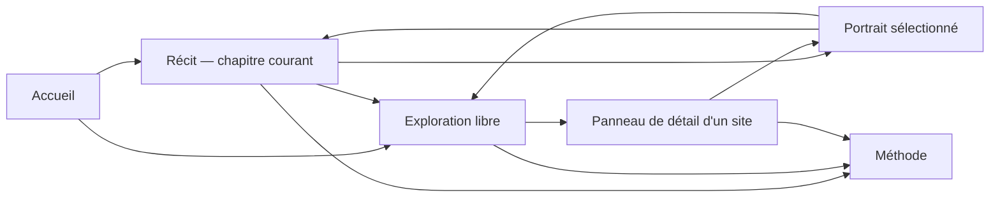

# Phase 10 — Parcours narratif et data storytelling

Version : **1.1 — angle d'ouverture rectifié après la première revue visuelle**
Statut : **parcours narratif maintenu, prologue et formulation centrale corrigés**
Date : 27 juillet 2026

## Intention

Le récit part de l'Orne que l'on représente aujourd'hui par ses vallées, ses
prairies, ses forêts et son agriculture. Cette image est réelle, mais
incomplète : le corpus fait apparaître une histoire industrielle nombreuse,
répartie dans le territoire et aujourd'hui peu visible dans sa représentation
courante.

L'enquête ne remplace pas le paysage rural par un décor d'usines. Elle montre
comment ruralité, agriculture, ressources, bourgs et industrie se sont
superposés. Elle ne qualifie pas l'Orne de département plus industrialisé qu'un
autre en l'absence de comparaison statistique.

La démonstration repose d'abord sur les données et les visualisations. Le texte
pose les questions, relie les preuves, raconte les études de cas et précise les
limites. Il ne commente pas longuement ce qu'une carte ou une chronologie montre
déjà.

Le parcours forme une page continue, découpée en chapitres partageables. Il
reste possible de rejoindre l'exploration ou un portrait à chaque étape.

## Arc général

```text
Installer l'image rurale actuelle
        ↓
Montrer qu'elle ne raconte pas toute l'histoire
        ↓
Faire apparaître le patrimoine industriel oublié
        ↓
Décrire la diversité des productions
        ↓
Suivre l'eau sans confondre proximité et causalité
        ↓
Montrer les vies successives des lieux
        ↓
Relier l'Orne à des réseaux plus larges
        ↓
Confronter les traces actuelles aux zones d'ombre
        ↓
Ouvrir l'exploration et montrer comment l'enquête est construite
```

## Répartition entre corpus complet et études de cas

### Vues portant sur le corpus complet

Les vues globales décrivent uniquement les 318 sites issus du corpus de
l'Inventaire industriel de l'Orne :

- localisation des 318 sites ;
- neuf secteurs documentés ;
- 403 phases d'activité ;
- 73 sites comportant plusieurs activités ;
- 34 sites relevant de plusieurs secteurs ;
- périodes documentaires disponibles pour les 318 sites ;
- distances à l'eau, à la forêt, aux ressources minérales et au rail ;
- quatre situations actuelles appuyées par une source récente ;
- 290 points approximatifs et 28 zones documentaires.

Ces vues ne prétendent pas représenter toutes les activités industrielles ayant
existé dans le département. Les appartenances sectorielles se recouvrent et
leurs effectifs ne s'additionnent pas pour retrouver 318.

### Études de cas

Les études de cas servent à établir une relation historique, décrire un
changement de production, incarner un réseau ou raconter une situation
actuelle. Elles ne prouvent pas qu'un mécanisme vaut pour tout le corpus.

Une étude de cas est retenue après lecture de son historique et de ses
activités, pas en fonction d'un score automatique. La richesse historique,
le nombre de médias et la diversité sectorielle servent seulement à repérer
les dossiers à examiner.

## Études de cas retenues

### Noyau éditorial

| Référence | Site | Commune | Rôle dans le récit | Matière disponible |
| --- | --- | --- | --- | --- |
| `IA00061172` | Usine de fabrication des métaux et moulins | Putanges-Pont-Écrepin | Cinq activités successives, de la métallurgie du XVIe siècle à l'hydroélectricité ; lien narratif avec Rabodanges | Historique fort, 2 médias |
| `IA00061088` | Moulin de Brochard | Longny-au-Perche | Moulin médiéval, tréfilerie puis scierie ; relation à la Commeauche explicitement documentée | Historique et description détaillés, 10 médias |
| `IA00061155` | Établissements Bohin | Saint-Sulpice-sur-Risle | Transformation d'un moulin en site métallurgique, continuité industrielle et situation actuelle documentée | Historique fort, 5 médias |
| `IA00060938` | Centrale hydroélectrique de Rabodanges | Rabodanges | Passage à un aménagement énergétique de grande échelle après-guerre | Historique fort, situation récente, 5 médias |
| `IA00060969` | Moulin d'Ozé, filature puis Moulinex | Alençon | Trajectoire lisible du moulin à l'électroménager, avec trois phases datées | Chronologie forte, 5 médias |
| `IA00060943` | Tréfilerie puis laiterie de Sainte-Gauburge | Échauffour | Passage de la métallurgie à l'agroalimentaire sur une même emprise | Historique fort, 6 médias |
| `IA00060953` | Tuilerie, fonderie puis usine d'appareils de levage | Sées | Quatre activités et changement d'échelle jusqu'aux équipements des Jeux olympiques de Montréal | Historique chiffré, 1 média |
| `IA00061086` | Usine à papier Abadie | Le Theil | Production, voie étroite, exportations et logements ouvriers ; ouverture sur des réseaux extérieurs | Historique fort, 113 médias |
| `IA00060924` | Chocolaterie de l'Abbaye Suisse Normande | Tinchebray | Matières premières et chaîne de transformation internationale | Historique chiffré, 35 médias |
| `IA00061092` | Usine de flaconnage | Saint-Evroult-Notre-Dame-du-Bois | Production exportée et modernisation des procédés | Historique fort, 20 médias |
| `IA00061029` | Grosse Forge d'Aube | Aube | Longue histoire métallurgique, énergie hydraulique et situation actuelle documentée | Historique fort, situation récente, 5 médias |
| `IA00061008` | Mine de Halouze | Saint-Clair-de-Halouze | Ensemble minier, modernisation et traces actuelles documentées | Historique fort, situation récente, 5 médias |

### Cas complémentaires et réserves

| Référence | Site | Utilité possible |
| --- | --- | --- |
| `IA00061149` | Imprimerie de La Chapelle-Montligeon | Diffusion internationale des imprimés et transformation ultérieure des ateliers |
| `IA00060914` | Tissage de la Blanchardière à Flers | Échelle du textile, nombre de métiers et d'ouvriers |
| `IA00060887` | Moulin à papier puis filature à Tinchebray | Machines conservées et changement d'activité |
| `IA00060912` | Ensemble minier de La Ferrière-aux-Étangs | Production, emplois et réseau industriel minier |
| `IA00061006` | Mine de Halouze, fours et plan incliné | Complément spatial au portrait de l'ensemble minier |
| `IA00061181` | Usine d'articles en caoutchouc à Flers | Diversification industrielle au XXe siècle |

Ces réserves peuvent remplacer un cas si la matière iconographique ou la
cohérence d'un chapitre s'avère meilleure lors de la direction artistique.

## Visualisations nécessaires

Le MVP narratif retient sept familles de visualisations. Il n'est pas prévu de
graphique supplémentaire sans question éditoriale nouvelle.

| Code | Visualisation | Périmètre | Fonction | Interaction essentielle |
| --- | --- | --- | --- | --- |
| V1 | Carte de révélation des sites | 318 sites | Faire apparaître la géographie industrielle | Défilement puis sélection |
| V2 | Carte et barres des secteurs | Corpus complet | Montrer la diversité des productions dans le corpus | Choix d'un secteur, mise en évidence sur la carte |
| V3 | Carte de l'eau et cas documentés | Corpus complet pour les distances, cas sélectionnés pour les relations historiques | Distinguer proximité et usage documenté | Activer l'eau, ouvrir un cas |
| V4 | Petits multiples de trajectoires | 73 sites multi-activités, puis cinq cas détaillés | Montrer les changements de production | Sélection d'une trajectoire |
| V5 | Carte de flux documentés | Quelques études de cas | Relier productions, approvisionnements et marchés extérieurs | Sélection d'un flux et de sa source |
| V6 | Vue des connaissances contemporaines | 318 sites, quatre cas récents | Montrer le déséquilibre entre données historiques et état actuel | Passer des inconnues aux quatre cas |
| V7 | Schéma de constitution et carte de précision | Corpus et sources | Montrer comment l'enquête transforme 319 dossiers en 318 sites qualifiés | Afficher les niveaux de précision |

### Chronologies retenues

Les chronologies sont utilisées à l'échelle des études de cas :

- Putanges-Pont-Écrepin ;
- moulin de Brochard ;
- moulin d'Ozé et Moulinex ;
- Sainte-Gauburge ;
- Sées ;
- Grosse Forge d'Aube.

Une chronologie animée des 403 activités n'est pas retenue. Seules 42 activités
et 29 sites possèdent une période d'activité suffisamment datée ; une animation
globale donnerait une précision artificielle. Les périodes documentaires restent
disponibles comme filtre dans l'exploration, avec leur méthode visible.

### Visualisations écartées du récit

- classement ou podium des secteurs ;
- carte animée prétendant reconstituer toute l'industrialisation dans le temps ;
- diagramme global des changements de secteurs sans chronologies suffisantes ;
- carte de pollution dérivée de CASIAS ;
- carte causale de l'eau, de la forêt, du rail ou des minerais ;
- bilan départemental de conservation ou d'accessibilité ;
- galerie exhaustive des médias.

## Structure narrative

Le récit comporte un prologue, cinq chapitres et une conclusion méthodologique.
Les titres restent des titres de travail jusqu'au bloc de direction artistique.

### Prologue — L'Orne que l'on croit connaître

**Question :** que manque-t-il à l'image uniquement rurale du département ?

**Idée principale :** les paysages ruraux ne sont pas l'opposé de l'histoire
industrielle. L'Inventaire révèle, dans ce même territoire, 318 sites et 403
phases d'activité aujourd'hui peu visibles dans le récit courant de l'Orne.

**Preuves :** géométries qualifiées, identifiants canoniques et phases
d'activité du corpus complet.

### Chapitre 1 — Un territoire de productions

**Question :** quelles activités le corpus fait-il apparaître et comment se
répartissent-elles ?

**Idée principale :** l'industrie documentée ne se réduit ni à un secteur ni à
quelques grandes villes ; agroalimentaire, métallurgie, textile, papier,
matériaux, mécanique, extraction, énergie et chimie se superposent.

**Preuves :** neuf secteurs, 403 activités, 34 sites multi-secteurs.

**Études de cas brèves :** chocolaterie de Tinchebray, flaconnage de
Saint-Evroult, mine de Halouze, imprimerie de Montligeon.

### Chapitre 2 — L'eau, une force et un fil spatial

**Question :** que peut-on dire de la proximité à l'eau sans transformer une
distance en explication automatique ?

**Idée principale :** l'eau structure visuellement une partie du corpus, mais
le lien fonctionnel doit être établi site par site.

**Preuves :** distances calculées pour 318 sites ; 103 sites à moins de 25
mètres et 110 entre 25 et 100 mètres d'un tronçon hydrographique ; historiques
et équipements documentant les usages de l'eau dans les cas retenus.

**Études de cas :** Brochard, Putanges-Pont-Écrepin, Bohin, Grosse Forge d'Aube
et Rabodanges.

### Chapitre 3 — Un lieu, plusieurs vies industrielles

**Question :** comment une même emprise change-t-elle de production ?

**Idée principale :** 73 sites comportent plusieurs activités ; les
transformations individuelles montrent mieux ces passages qu'un diagramme
global privé de chronologies suffisantes.

**Preuves :** 60 sites à deux activités, 11 à trois, un à quatre et un à cinq.

**Études de cas principales :** Putanges-Pont-Écrepin, Ozé-Moulinex,
Sainte-Gauburge, Sées et Brochard.

### Chapitre 4 — De l'Orne vers d'autres réseaux

**Question :** ces sites ruraux ou de petites villes fonctionnaient-ils dans un
espace uniquement local ?

**Idée principale :** plusieurs dossiers documentent des approvisionnements,
des transports, des marchés et des circulations à l'échelle nationale ou
internationale.

**Preuves :** historiques propres aux sites ; aucune généralisation à tout le
corpus.

**Études de cas :**

- papier Abadie exporté et relié au moulin de Mâle par voie étroite ;
- chocolat utilisant des matières premières de Côte d'Ivoire et du Cameroun,
  préalablement transformées à Berlin ;
- flacons vendus en France, en Angleterre et en Espagne ;
- équipements de levage de Sées liés aux Jeux olympiques de Montréal ;
- imprimés de Montligeon diffusés dans plusieurs langues, en cas complémentaire.

### Chapitre 5 — Ce qu'il en reste, ce que l'on ignore

**Question :** que sait-on réellement de la situation actuelle des lieux ?

**Idée principale :** le corpus historique est riche, mais il ne permet pas un
bilan actuel du département. L'absence de donnée récente devient une information
à montrer, pas à combler.

**Preuves :** quatre situations documentées par une source récente ; 315
conservations et 316 accessibilités restent inconnues.

**Études de cas :** Bohin, Grosse Forge d'Aube, centrale de Rabodanges et mine
de Halouze.

### Conclusion — Une carte construite, pas une évidence

**Question :** comment cette géographie a-t-elle été établie et avec quelle
précision ?

**Idée principale :** la publication résulte d'un travail de rapprochement,
de qualification et de conservation des incertitudes.

**Preuves :** 319 dossiers sources, 318 sites canoniques, 314 historiques, 257
descriptions, 1 900 relations média-site, 290 points approximatifs et 28 zones
documentaires.

**Sortie :** ouvrir l'exploration complète avec les limites et la légende déjà
comprises.

## Storyboard écran par écran

### Prologue

| Écran | Contenu journalistique | Visualisation et mouvement | Interaction ou sortie |
| --- | --- | --- | --- |
| P0 | Titre de travail, chapô et question : « Ce paysage raconte-t-il toute l'histoire du territoire ? » | Photographie actuelle de vallées, prairies et forêts ; aucune usine générique ajoutée | Commencer, explorer directement ou rechercher |
| P1 | « Cette image est réelle. Elle est incomplète. » | Le contour exact de l'Orne et quelques sites émergent directement du paysage | Continuer ou sélectionner un premier point |
| P2 | « 318 sites, 403 phases d'activité » | V1 : l'ensemble des sites apparaît et la photographie cède progressivement la place à la carte de données | Sélectionner un point sans quitter le récit |
| P3 | « Une histoire industrielle oubliée, inscrite dans les mêmes vallées et les mêmes bourgs » | La carte se stabilise ; deux portes deviennent visibles | Continuer le récit ou ouvrir l'exploration dans le même état |

Le passage de 319 dossiers sources à 318 sites canoniques est déplacé vers la
conclusion méthodologique. Cette opération est essentielle à la fiabilité du
corpus, mais elle ne constitue pas l'accroche éditoriale du sujet.

### Chapitre 1 — Un territoire de productions

| Écran | Contenu journalistique | Visualisation et mouvement | Interaction ou sortie |
| --- | --- | --- | --- |
| C1.1 | Introduction à la diversité des productions | V2 : les points se colorent par secteur ; les neuf secteurs apparaissent | Choisir un secteur |
| C1.2 | Mise en garde sur les multi-appartenances | Barres des effectifs du corpus et mise en évidence des 34 sites multi-secteurs | Afficher la définition d'un secteur |
| C1.3 | Série de quatre exemples contrastés | Quatre vignettes image + mini-carte : chocolat, verre, mine, imprimerie | Ouvrir un cas ou poursuivre |
| C1.4 | Transition : les implantations ne sont pas seulement sectorielles | Retour à la carte générale, apparition du réseau hydrographique | Rejoindre l'exploration filtrée par secteur |

### Chapitre 2 — L'eau, une force et un fil spatial

| Écran | Contenu journalistique | Visualisation et mouvement | Interaction ou sortie |
| --- | --- | --- | --- |
| C2.1 | Distances observées et limite d'interprétation | V3 : eau + quatre classes de distance | Activer ou masquer l'eau |
| C2.2 | Moulin de Brochard : moulin, tréfilerie, scierie | Image, carte locale et chronologie courte | Ouvrir le portrait de Brochard |
| C2.3 | Putanges : métallurgie, moulins puis énergie | Chronologie du XVIe au XXe siècle | Passer d'une phase à l'autre |
| C2.4 | Du site de Putanges à l'aménagement de Rabodanges | Transition cartographique entre les deux sites et changement d'échelle | Ouvrir le portrait de Rabodanges |
| C2.5 | Bohin et Aube : l'eau ne raconte pas toujours la même industrie | Deux petits multiples combinant roue, activité et dates | Comparer les deux cas |

### Chapitre 3 — Un lieu, plusieurs vies industrielles

| Écran | Contenu journalistique | Visualisation et mouvement | Interaction ou sortie |
| --- | --- | --- | --- |
| C3.1 | « 73 sites ont plusieurs activités structurées » | V4 : distribution 241/60/11/1/1 selon le nombre d'activités, quatre sites sans activité productive séparés | Filtrer la carte sur les sites multi-activités |
| C3.2 | Cinq trajectoires, cinq logiques différentes | Petits multiples de Putanges, Ozé, Sainte-Gauburge, Sées et Brochard | Choisir une trajectoire |
| C3.3 | Ozé : moulin, filature, électroménager | Chronologie datée, image et évolution du bâti | Ouvrir le portrait d'Ozé |
| C3.4 | Sainte-Gauburge : du fil métallique au lait | Basculer entre les deux familles sectorielles sur la même emprise | Ouvrir le portrait |
| C3.5 | Sées : de l'argile aux appareils de levage | Quatre étapes et chiffres d'emploi documentés | Continuer vers les réseaux extérieurs |

### Chapitre 4 — De l'Orne vers d'autres réseaux

| Écran | Contenu journalistique | Visualisation et mouvement | Interaction ou sortie |
| --- | --- | --- | --- |
| C4.1 | « Ces sites ne fonctionnent pas en vase clos » | V5 : carte de l'Orne puis apparition de destinations documentées | Sélectionner un flux |
| C4.2 | Papier Abadie : Mâle, Le Theil et les marchés extérieurs | Flux local par voie étroite, image de l'usine et production documentée | Ouvrir le portrait Abadie |
| C4.3 | Chocolat et flacons : matières premières et exportations | Deux cartes de flux séparées, jamais agrégées | Basculer entre les deux cas |
| C4.4 | Sées : des matériaux aux équipements de Montréal | Trajectoire du site et destination ponctuelle Montréal | Retourner à la carte du corpus |

### Chapitre 5 — Ce qu'il en reste, ce que l'on ignore

| Écran | Contenu journalistique | Visualisation et mouvement | Interaction ou sortie |
| --- | --- | --- | --- |
| C5.1 | Question sur les traces actuelles | V6 : 318 unités apparaissent, quatre seulement deviennent des cas récemment documentés | Afficher les chiffres exacts |
| C5.2 | Pourquoi « inconnu » n'est pas « disparu » | Comparaison visuelle entre absence de donnée et observation récente | Ouvrir la méthode |
| C5.3 | Bohin et Aube | Deux portraits associant image actuelle, activité ou musée et source récente | Ouvrir les portraits |
| C5.4 | Rabodanges et Halouze | Deux situations contrastées, sans en tirer un bilan départemental | Ouvrir les portraits |
| C5.5 | Transition : la carte actuelle reste une enquête à poursuivre | Les 314 sites sans situation récente réapparaissent comme questions ouvertes | Explorer les sites à documenter |

### Conclusion — Une carte construite

| Écran | Contenu journalistique | Visualisation et mouvement | Interaction ou sortie |
| --- | --- | --- | --- |
| F1 | De 319 dossiers à 318 sites | V7 : chaîne dossier → rapprochement → site canonique → activité → source | Ouvrir la méthode détaillée |
| F2 | Textes, médias et décisions humaines | 314 historiques, 257 descriptions et 1 900 relations média-site ; aucune sélection automatique | Afficher les sources d'un cas |
| F3 | Une localisation qualifiée | Carte séparant 290 points approximatifs et 28 zones documentaires | Activer les symboles de précision |
| F4 | Invitation à poursuivre l'enquête | Retour à la carte complète avec les filtres disponibles | Explorer les 318 sites |

## Passages entre récit, exploration et portraits



### Règles de continuité

- Le passage du récit à l'exploration conserve le secteur, le site ou la couche
  active lorsque cela a un sens.
- Le retour au récit rejoint le chapitre et l'écran quittés.
- Un portrait indique toujours pourquoi le site apparaît dans le récit et
  propose un retour au chapitre concerné.
- Le panneau de détail d'un site ne force pas l'ouverture d'un portrait.
- Chaque chapitre possède une ancre partageable.
- Une URL d'exploration conserve les filtres et le site sélectionné.

## Lecture non linéaire

Le récit reste recommandé, mais quatre entrées sont possibles :

1. commencer au prologue ;
2. rejoindre directement un chapitre ;
3. explorer la carte ;
4. rechercher un lieu ou une activité.

Le sommaire reste disponible sans occuper en permanence une grande partie de
l'écran. Les chapitres déjà vus ne conditionnent pas techniquement l'accès aux
suivants. Les définitions nécessaires sont accessibles localement au moment où
elles deviennent utiles.

## Alternatives textuelles et accessibles

| Élément visuel | Alternative prévue |
| --- | --- |
| Carte des 318 sites | Liste synchronisée, recherche, nombre de résultats et regroupement par commune ou secteur |
| Carte par secteur | Tableau des effectifs du corpus et liste des sites correspondants |
| Carte des distances à l'eau | Répartition dans les quatre classes de distance et liste des cas documentés |
| Chronologie d'un site | Liste ordonnée des phases avec bornes, précision et texte source |
| Petits multiples de trajectoires | Tableau site × phases d'activité |
| Carte de flux | Liste origine, destination, produit, date et source pour chaque cas |
| Vue des situations actuelles | Valeurs numériques et liste des quatre situations récentes |
| Schéma de constitution du corpus | Liste ordonnée des étapes et effectifs |
| Images et documents | Légende descriptive, crédit et texte alternatif adapté à leur fonction dans le récit |

Le survol n'est jamais la seule manière d'obtenir une information. Toute
sélection est possible au clavier et possède un état visible.

## Critères de validation du parcours

Le parcours est considéré comme validé si :

- chaque chapitre pose une question différente ;
- chaque affirmation globale renvoie au corpus complet ou à un effectif défini ;
- chaque relation historique spécifique repose sur une étude de cas sourcée ;
- aucune proximité spatiale n'est transformée en causalité ;
- aucune chronologie globale n'invente des dates ;
- les études de cas couvrent plusieurs secteurs, périodes et parties du
  département ;
- chaque visualisation possède une fonction et une alternative textuelle ;
- la lecture libre reste possible sans casser la progression éditoriale ;
- les portraits prolongent le récit sans former un catalogue ;
- le nombre de visualisations reste limité aux sept familles définies.

**Décision : parcours narratif et data storytelling du bloc 2 validés comme
base du storyboard visuel et de la direction artistique.**
