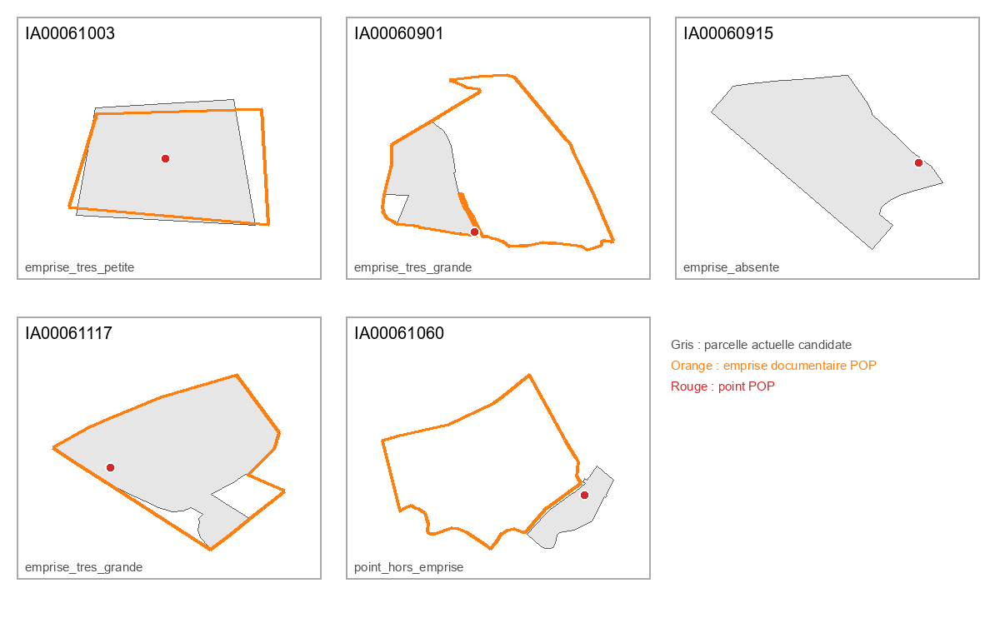

# Phase 6 — Contrôle cartographique du corpus pilote

Contrôle effectué le 22 juillet 2026 sur les 30 sites pilotes.

## Résultat simple

| Contrôle | Résultat |
|---|---:|
| Points contrôlés | 30 |
| Emprises documentaires contrôlées | 29 |
| Parcelles actuelles candidates superposées | 30 |
| Points BAN superposés | 4 |
| Points grossièrement aberrants | 0 |
| Cas sensibles relus | 9 |
| Cas sensibles sans décision | 0 |

La carte de contrôle se trouve dans `qgis/controle_phase6.qgs`. Elle superpose
les points POP, les emprises documentaires, les parcelles actuelles candidates,
les résultats BAN et un fond OpenStreetMap.

## Recherche des points aberrants

Un point est signalé comme aberrant s'il se trouve hors de l'enveloppe large de
l'Orne, si ses coordonnées Lambert-93 et WGS84 sont incohérentes, si le code de
la parcelle ne correspond pas à la commune actuelle, s'il ne rencontre pas sa
parcelle candidate ou s'il se trouve à moins de 50 mètres d'un autre site.

Aucun des 30 points ne déclenche ces alertes. Les deux sites les plus proches
restent séparés de 311 mètres : aucun doublon géographique immédiat n'apparaît.

Une discordance locale est cependant conservée : le point de `IA00061060` se
trouve à 11,7 mètres de son contour documentaire. Ce décalage n'est pas une
erreur grossière, mais il interdit de présenter l'un des deux comme plus précis
sans source complémentaire.

## Emprises et cas sensibles

Les seuils de 100 m² et 100 000 m² servent uniquement à déclencher une relecture.
Ils ne définissent pas ce qu'est une emprise industrielle correcte.

| Référence | Motif | Décision |
|---|---|---|
| `IA00061003` | contour de 25 m² | Conserver comme zone documentaire approximative |
| `IA00060901` | contour de 200 749 m² | Conserver comme ensemble étendu non vérifié |
| `IA00060915` | aucune emprise POP | Afficher seulement le point approximatif |
| `IA00061117` | contour de 120 172 m² | Conserver comme ensemble étendu non vérifié |
| `IA00061060` | point à 11,7 m du contour | Conserver les deux géométries séparées et à vérifier |

La superposition utilisée pour cette relecture est conservée ci-dessous. Le
gris représente la parcelle actuelle candidate, l'orange l'emprise documentaire
POP et le rouge le point POP.

Quatre autres alertes concernent le géocodage plutôt que les emprises :

- `IA00060969` : le résultat BAN non concordant reste rejeté ;
- `IA00061073`, `IA00060909` et `IA00061166` : l'adresse est trop large ou
  comporte plusieurs numéros ; aucun point BAN artificiel n'est créé.

Les neuf décisions détaillées et leurs notes sont enregistrées dans
`config/controle_cartographique_pilote.yml`.

## Erreurs et limites

- aucune coordonnée n'a été corrigée ou déplacée automatiquement ;
- les 30 points conservent le statut de géométrie approximative ;
- les contours POP sont des zones documentaires, pas des relevés du bâti actuel ;
- les parcelles actuelles ne prouvent ni l'emprise historique ni la conservation ;
- le fond OpenStreetMap sert au repérage et non à la validation patrimoniale ;
- le fichier QGIS et les cinq GeoJSON ont été validés structurellement, mais
  QGIS n'est pas installé dans l'environnement d'exécution : l'ouverture et le
  rendu final du projet restent à vérifier sur un poste équipé de QGIS 3.x.

## Décision

Le bloc de contrôle cartographique est validé. Aucun point grossièrement
aberrant n'a été trouvé. Les neuf cas sensibles ont une décision explicite et
aucune géométrie n'a reçu une précision supérieure à ce que permettent les
sources.
